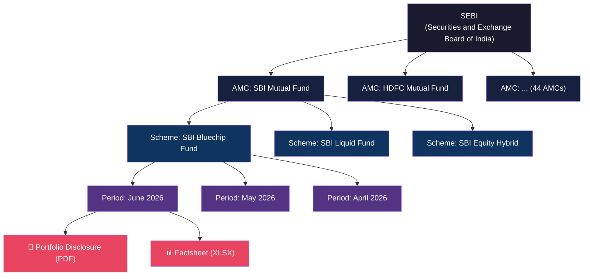
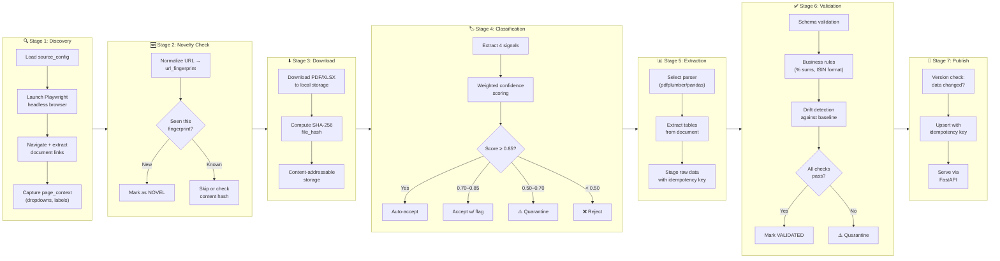
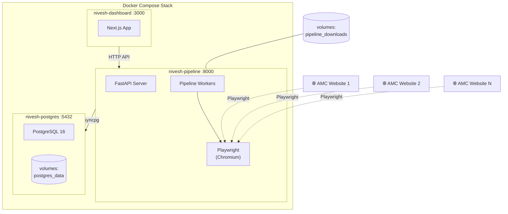
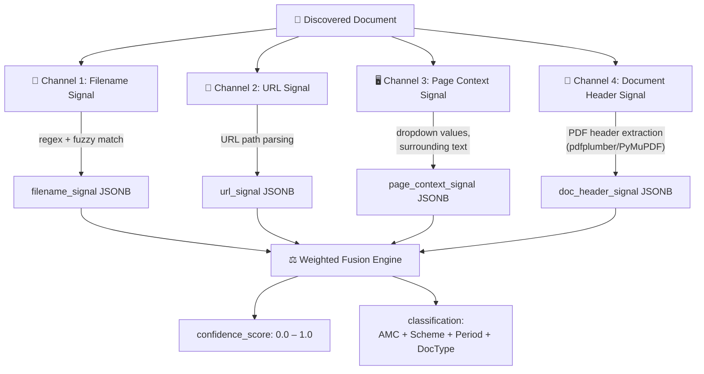
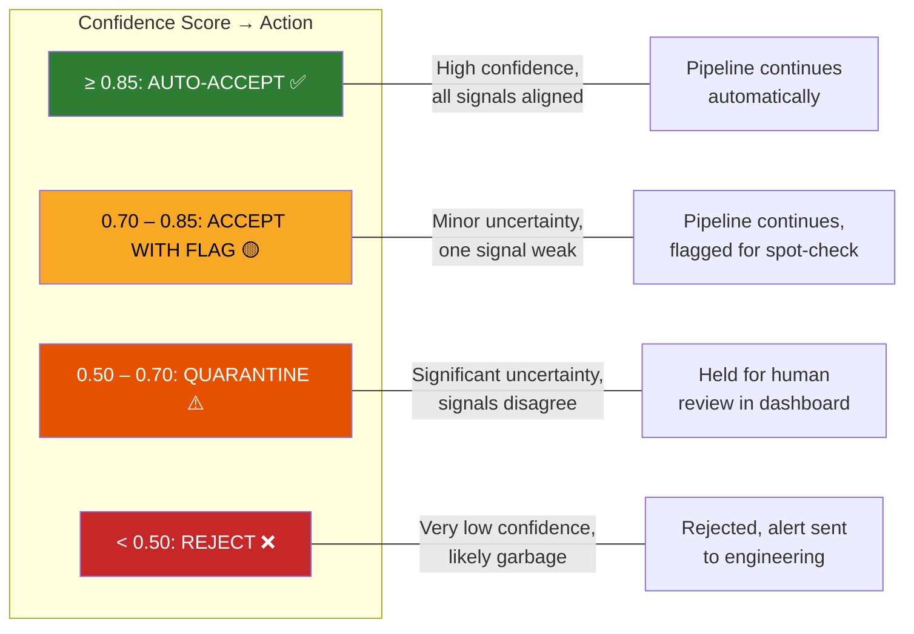
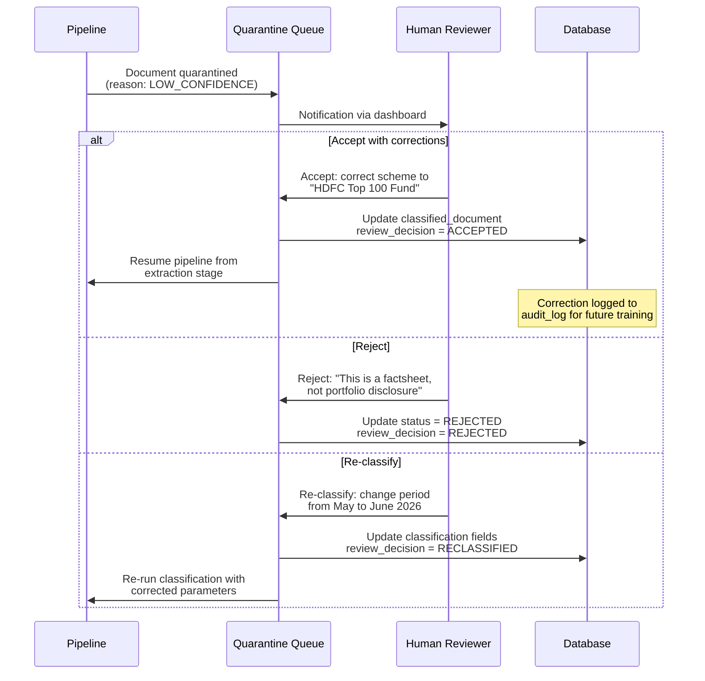
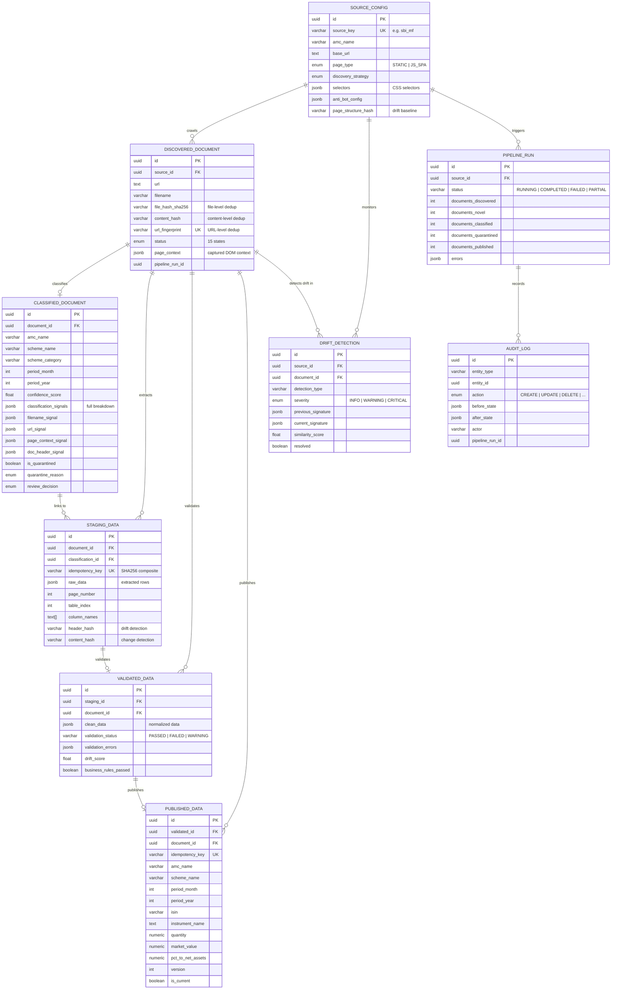
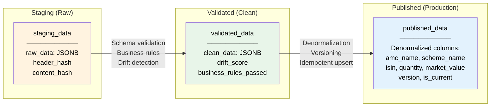
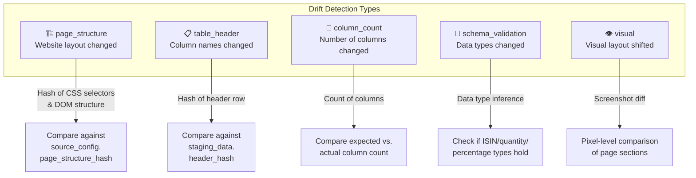
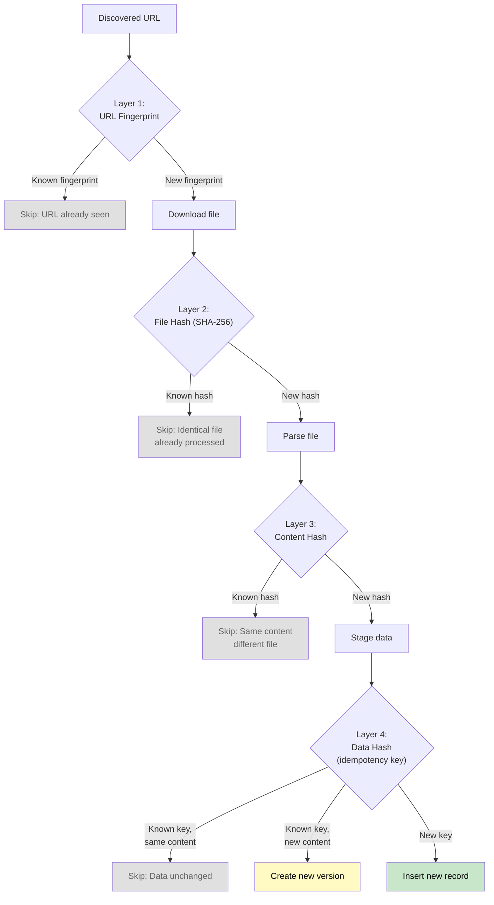

# Nivesh AI — AMC Data Pipeline: Design Document

> **Version**: 1.0  
> **Date**: June 2026  
> **Author**: Founding Engineering Team  
> **Status**: Living Document

---

## Table of Contents

1. [Executive Summary](#1-executive-summary)
2. [System Taxonomy](#2-system-taxonomy)
3. [Architecture Overview](#3-architecture-overview)
4. [Heuristic Design](#4-heuristic-design)
5. [Data Model](#5-data-model)
6. [Drift Detection Strategy](#6-drift-detection-strategy)
7. [Novelty Heuristics](#7-novelty-heuristics)
8. [Idempotency Design](#8-idempotency-design)
9. [Trade-off Analysis](#9-trade-off-analysis)
10. [Failure Modes & Recovery](#10-failure-modes--recovery)
11. [Observability](#11-observability)

---

## 1. Executive Summary

Indian mutual fund regulation (SEBI Circular SEBI/HO/IMD/IMD-PoD1/P/CIR/2021/666) mandates that every Asset Management Company (AMC) publicly disclose the complete portfolio holdings of each scheme on a monthly basis. These disclosures — published as PDFs, Excel files, and sometimes raw HTML — are scattered across 40+ AMC websites, each with its own layout conventions, naming patterns, and delivery mechanisms.

**Nivesh AI's AMC Data Pipeline** is a production-grade ingestion system that automatically discovers, downloads, classifies, extracts, validates, and publishes this data into a unified, query-ready PostgreSQL store. The pipeline transforms a chaotic, heterogeneous regulatory landscape into clean, structured, auditable financial data.

### Why This is Hard

| Challenge | Implication |
|---|---|
| **No standard format** | Each AMC uses different PDF layouts, column orderings, and naming conventions |
| **JavaScript-heavy SPAs** | Most AMC sites require headless browser rendering — no static HTML to scrape |
| **Ambiguous filenames** | `MFS_jun.pdf` could be any fund, any year — identity resolution is non-trivial |
| **Silent schema changes** | AMCs change their website structure without notice, breaking parsers |
| **Regulatory urgency** | Missing or corrupt data in production means incorrect financial analysis |

The system is designed around three core principles:

1. **Fail loud, not silent** — Better to quarantine a document than to publish garbage data.
2. **Heuristics over hardcoding** — Weighted signal fusion adapts to messy real-world data.
3. **Full auditability** — Every state transition, classification decision, and data transformation is logged.

---

## 2. System Taxonomy

### 2.1 AMC → Scheme → Period Hierarchy

The Indian mutual fund ecosystem follows a strict hierarchical structure mandated by SEBI:



### 2.2 Document Types

| Document Type | Format | Frequency | Contains |
|---|---|---|---|
| **Portfolio Disclosure** | PDF, XLSX | Monthly (mandatory) | Complete holdings: ISIN, instrument name, quantity, market value, % to NAV |
| **Factsheet** | PDF | Monthly | Performance data, fund manager commentary, sector allocation, top holdings |
| **Half-Yearly Report** | PDF | Semi-annual | Detailed portfolio with additional compliance and statutory disclosures |

### 2.3 SEBI Regulatory Context

SEBI requires all AMCs to disclose portfolio holdings **within 10 business days of month-end**. This creates a predictable window:

- **Day 1–10 of each month**: AMCs upload previous month's portfolio disclosure
- **Disclosure must be complete**: Every scheme, every holding, every ISIN
- **Format is not standardized**: SEBI mandates *what* to disclose, not *how*

This regulatory cadence drives our pipeline scheduling — we know *when* to look, but not *where exactly* or *in what format*.

### 2.4 Scheme Categories (SEBI Classification)

```
├── Equity (Large Cap, Mid Cap, Small Cap, Multi Cap, Flexi Cap, Sectoral, ELSS, ...)
├── Debt (Liquid, Overnight, Ultra Short Duration, Corporate Bond, Gilt, ...)
├── Hybrid (Balanced Advantage, Aggressive Hybrid, Conservative Hybrid, ...)
├── Solution-Oriented (Retirement, Children's Fund, ...)
└── Other (Index Funds, ETFs, FoFs, ...)
```

---

## 3. Architecture Overview

### 3.1 Pipeline Stages



### 3.2 Technology Stack

| Layer | Technology | Rationale |
|---|---|---|
| **Runtime** | Python 3.12 | Ecosystem depth for data/scraping/ML |
| **API Framework** | FastAPI (uvicorn) | Async-native, auto OpenAPI docs, Pydantic validation |
| **Browser Automation** | Playwright (Chromium) | Best-in-class SPA rendering, network interception, stealth mode |
| **PDF Parsing** | pdfplumber + PyMuPDF | pdfplumber for table extraction, PyMuPDF for text/header extraction |
| **Excel Parsing** | pandas + openpyxl + xlrd | Handles .xlsx (openpyxl) and legacy .xls (xlrd) |
| **Database** | PostgreSQL 16 | JSONB for flexible schemas, strong ACID guarantees, UUID support |
| **ORM** | SQLAlchemy 2.0 (async) | Async engine via asyncpg, type-safe queries, Alembic migrations |
| **Fuzzy Matching** | fuzzywuzzy + python-Levenshtein | Fast string similarity for scheme name resolution |
| **Logging** | structlog | Structured JSON logging, processor pipeline, context binding |
| **Containerization** | Docker Compose | Reproducible multi-service deployment (Postgres, Pipeline, Dashboard) |
| **Dashboard** | Next.js | Quarantine review UI, pipeline monitoring |

### 3.3 Deployment Architecture



---

## 4. Heuristic Design

> **This section is the intellectual core of the system.** Unlike a typical ETL pipeline where source schemas are well-defined, we are ingesting documents from 40+ websites where the only "contract" is a SEBI regulation that says "disclose your holdings." Every other aspect — filename, URL structure, document layout — is entirely at the AMC's discretion.

### 4.1 The Identity Resolution Problem

Consider this real scenario:

> A Playwright browser session navigates to `https://sbimf.com/portfolio-disclosures`, selects "June 2026" from a dropdown, and discovers a download link pointing to `https://cdn.sbimf.com/docs/MFS_jun.pdf`.

**What do we actually know?**

- The file is `MFS_jun.pdf` — probably June, but what year? What fund? What does "MFS" stand for?
- The URL contains `sbimf.com` — likely SBI Mutual Fund, but this is the CDN domain
- The page had a dropdown set to "June 2026" — but does this PDF correspond to that selection?
- Inside the PDF, page 1 header reads "SBI Magnum Multicap Fund — Portfolio as on June 30, 2026"

No single signal is fully reliable. Filenames are abbreviated. URLs can be shared CDN paths. Page context might be stale from a previous interaction. Only by **fusing multiple signals** can we arrive at a confident classification.

### 4.2 Four-Channel Signal Extraction

Every discovered document is analyzed through four independent classification channels:



#### Channel 1: Filename Signal (Weight: 0.20)

**What it does**: Applies regex patterns and fuzzy matching against the filename to extract AMC, scheme, period, and document type.

```
Filename: "SBI_Bluechip_Fund_Portfolio_Jun2026.pdf"
                                               
Regex extractions:
  - AMC pattern:     /^(SBI|HDFC|ICICI|..._/i     → "SBI"
  - Period pattern:  /(Jan|Feb|...|Jun)\s*(\d{4})/i → "Jun", "2026"
  - DocType pattern: /(portfolio|factsheet|half.?yearly)/i → "portfolio"
  - Scheme fuzzy:    fuzzywuzzy.extractOne("Bluechip_Fund", known_schemes) 
                     → "SBI Bluechip Fund" (score: 92)
```

**Limitations**: Filenames are often abbreviated (`MFS_jun.pdf`), use internal codes, or omit the year entirely. That's why this channel only gets 0.20 weight.

#### Channel 2: URL Signal (Weight: 0.15)

**What it does**: Parses the download URL path segments and query parameters for classification hints.

```
URL: https://cdn.sbimf.com/docs/equity/portfolio/2026/06/bluechip.pdf

Path analysis:
  - Domain:  sbimf.com     → AMC: "SBI Mutual Fund"
  - Segment: /equity/      → Category: "Equity"
  - Segment: /portfolio/   → DocType: "Portfolio Disclosure"
  - Segment: /2026/06/     → Period: June 2026
  - Filename: bluechip.pdf → Scheme hint: "Bluechip"
```

**Limitations**: Many AMCs use flat CDN structures (`/docs/file123.pdf`) with no meaningful path hierarchy. CDN domains may not match AMC names. Hence the lowest weight at 0.15.

#### Channel 3: Page Context Signal (Weight: 0.25)

**What it does**: Captures the surrounding DOM context at the time of discovery — dropdown selections, section headers, table row labels, and nearby text.

```json
{
  "page_context": {
    "dropdown_values": {
      "month_selector": "June",
      "year_selector": "2026", 
      "fund_type": "Equity"
    },
    "section_heading": "Portfolio Disclosure - Equity Schemes",
    "table_row_label": "SBI Bluechip Fund - Regular Plan",
    "link_text": "Download Portfolio"
  }
}
```

**Why 0.25**: Page context is generally reliable because it captures the *state of the page* when the download link was discovered. If the user (our bot) selected "June 2026" and "Equity" from dropdowns, the resulting links are likely for June 2026 equity schemes. However, single-page apps sometimes lazy-load content, and stale DOM state can occasionally mislead this channel.

#### Channel 4: Document Header Signal (Weight: 0.40)

**What it does**: Opens the downloaded PDF/XLSX and extracts text from the first page header, title metadata, and leading rows.

```
PDF Page 1 Header:
"SBI Mutual Fund
 SBI Bluechip Fund — Regular Plan — Growth
 Portfolio as on June 30, 2026
 (As per SEBI Circular dated ...)"

Extractions:
  - AMC:      "SBI Mutual Fund"          (exact match)
  - Scheme:   "SBI Bluechip Fund"        (exact match)
  - Period:   "June 30, 2026"            (date parse → June 2026)
  - DocType:  "Portfolio"                (keyword match)
```

**Why 0.40 (highest weight)**: The document header is the **most authoritative signal** — it comes from the document itself, not from the website's DOM or URL structure. AMCs are legally required to title their disclosures correctly. If the PDF says "HDFC Top 100 Fund, May 2026," that's almost certainly what it is, regardless of what the filename or URL suggests.

### 4.3 Weighted Confidence Scoring Formula

The final confidence score is computed as follows:

```
base_score = (filename_conf × 0.20) + (url_conf × 0.15) + (page_ctx_conf × 0.25) + (doc_header_conf × 0.40)
```

**Agreement Bonus (+0.10)**: If ≥3 of the 4 channels independently agree on the same classification (AMC + scheme + period), we add a bonus:

```
if channels_agreeing ≥ 3:
    base_score += 0.10
```

*Rationale*: When multiple independent signals converge on the same answer, our confidence should increase non-linearly. Three independent witnesses agreeing is significantly more reliable than any single source.

**Disagreement Penalty (−0.15)**: If any two channels actively contradict each other (e.g., filename says "HDFC" but document header says "SBI"), we apply a penalty:

```
if any two channels contradict on AMC or period:
    base_score -= 0.15
```

*Rationale*: Contradictory signals are a strong indicator of misclassification risk. A mismatch between filename and document header might mean the file was renamed, the wrong document was linked, or our regex pattern is wrong. The penalty is intentionally harsh (−0.15) because the cost of publishing misclassified data far exceeds the cost of manual review.

**Final Score**:

```
confidence_score = clamp(base_score + agreement_bonus - disagreement_penalty, 0.0, 1.0)
```

#### Why These Specific Weights?

| Channel | Weight | Rationale |
|---|---|---|
| `doc_headers` | **0.40** | Legally mandated title; tamper-resistant; the "ground truth" from the document itself |
| `page_context` | **0.25** | Reflects the navigational state at discovery time; reliable but subject to SPA quirks |
| `filename` | **0.20** | Often informative but frequently abbreviated, inconsistent across AMCs |
| `url_signals` | **0.15** | Useful when structured, but many AMCs use flat CDN URLs with no semantic content |

The weights sum to **1.00**, making the base score a proper weighted average. The agreement bonus and disagreement penalty then shift the score based on inter-channel consistency.

### 4.4 Confidence Thresholds & Decision Boundaries



| Threshold | Range | Action | Typical Scenario |
|---|---|---|---|
| **Auto-accept** | ≥ 0.85 | Pipeline proceeds without human intervention | All 4 channels agree; well-structured AMC site |
| **Accept with flag** | 0.70 – 0.85 | Proceeds but marked for periodic spot-check | 3 channels agree, 1 has low confidence (e.g., flat URL) |
| **Quarantine** | 0.50 – 0.70 | Halted until human review via dashboard | 2 channels disagree, or filename is ambiguous |
| **Reject** | < 0.50 | Immediately rejected, alert fired | File is likely not a portfolio disclosure at all |

#### Additional Quarantine Triggers

Beyond confidence scoring, the system quarantines documents for:

| Trigger | Condition | Reason |
|---|---|---|
| **Stale Period** | Detected period is > 3 months old | AMC may have uploaded an old document to a new URL |
| **Unknown Scheme** | Scheme name doesn't fuzzy-match any known scheme (score < 60) | Could be a new scheme, or a misclassification |
| **AMC Mismatch** | Document header AMC ≠ source_config AMC | Wrong document uploaded, or CDN cross-linking |
| **Duplicate Content** | content_hash matches an existing document for a different scheme | Same PDF linked from multiple places |

### 4.5 Quarantine System: Human-in-the-Loop



**Feedback Loop**: Every human correction is stored in the `audit_log` table with `before_state` and `after_state` JSONB snapshots. Over time, these corrections form a training dataset that can be used to:

1. **Tune channel weights** — If filename signals are consistently wrong for a particular AMC, reduce their weight for that source.
2. **Add regex patterns** — When a reviewer corrects a scheme name, the corrected mapping can be added to the fuzzy match dictionary.
3. **Adjust thresholds** — If too many auto-accepted documents are later found incorrect, lower the auto-accept threshold.

---

## 5. Data Model

### 5.1 Entity-Relationship Diagram



### 5.2 Table Descriptions

| # | Table | Purpose | Key Design Decisions |
|---|---|---|---|
| 1 | `source_config` | Stores per-AMC crawl configuration | JSONB `selectors` for flexible CSS selector storage; `page_structure_hash` for drift detection baseline |
| 2 | `discovered_document` | Tracks every document URL found during crawling | Triple dedup columns (`url_fingerprint`, `file_hash_sha256`, `content_hash`); 15-state status machine |
| 3 | `classified_document` | Stores classification results with full signal breakdown | Each signal channel stored separately for debuggability; quarantine workflow built-in |
| 4 | `staging_data` | Raw extracted data before validation | `idempotency_key` prevents re-insertion; `header_hash` enables drift detection |
| 5 | `validated_data` | Clean data that passed validation rules | Drift score and validation errors preserved for audit; business rules flag |
| 6 | `published_data` | Production-ready, query-optimized holdings data | Versioned with `is_current` flag; denormalized AMC/scheme for query performance |
| 7 | `drift_detection` | Records structural changes in source websites or documents | Stores before/after signatures as JSONB; resolution workflow with actor tracking |
| 8 | `audit_log` | Immutable event log for every state change | `before_state`/`after_state` JSONB snapshots; links to `pipeline_run_id` |
| 9 | `pipeline_run` | Tracks each pipeline execution with aggregate stats | Counters for discovered/novel/classified/quarantined/published; error aggregation |

### 5.3 Idempotency Key Design

The idempotency key is a critical mechanism that prevents data duplication across pipeline re-runs:

```
idempotency_key = SHA256(source_id + period + scheme_name + content_hash)
```

| Component | Purpose |
|---|---|
| `source_id` | Ties data to a specific AMC source |
| `period` | Month + year of the disclosure |
| `scheme_name` | The specific fund scheme |
| `content_hash` | SHA-256 of the actual data content |

**Why these four components?**

- `source_id + period + scheme_name` uniquely identifies a *logical* disclosure (e.g., "SBI Bluechip Fund, June 2026")
- `content_hash` ensures that if the same logical disclosure is re-published with different data, it creates a new version rather than being silently deduplicated

Both `staging_data` and `published_data` have `UNIQUE` constraints on `idempotency_key`, making the upsert pattern safe for concurrent and repeated runs.

### 5.4 Data Flow: Staging → Validated → Published



**Why three stages?**

1. **Staging** preserves the raw extracted data exactly as it came from the parser. If a validation rule changes, we can re-validate from staging without re-downloading and re-parsing.
2. **Validated** applies business rules and normalization (e.g., standardizing ISIN formats, trimming whitespace, converting percentage strings to decimals). Failures here don't corrupt staging.
3. **Published** is the denormalized, query-optimized, versioned form. It's what the API serves. Versioning via `is_current` allows us to keep historical versions while always serving the latest.

---

## 6. Drift Detection Strategy

### 6.1 The Problem

AMC websites change without notice. A website redesign, a new CMS, or even a minor CSS class rename can break our scrapers and parsers. Traditional scraping solutions discover these breaks only when they produce empty results or garbled data. By then, the damage is done.

**Our philosophy: Fail loud, not silent.** We proactively detect changes and alert before they corrupt data.

### 6.2 Five Detection Types



| Type | What It Detects | How It Works | Severity |
|---|---|---|---|
| `page_structure` | AMC website redesign | Hashes key CSS selectors + DOM hierarchy; compares to stored `page_structure_hash` in `source_config` | **CRITICAL** — likely breaks discovery |
| `table_header` | Column name changes in PDF/XLSX | Hashes the header row of extracted tables; compares to stored `header_hash` in `staging_data` | **WARNING** — may break extraction |
| `column_count` | Columns added or removed | Counts columns in current extraction vs. previous baseline | **WARNING** — parser may need update |
| `schema_validation` | Data type changes | Validates that ISIN fields are 12 chars, quantities are numeric, percentages sum to ~100% | **CRITICAL** if fundamental types change |
| `visual` | Subtle layout shifts | Playwright screenshot comparison of page sections (pixel-level diff) | **INFO** — may indicate upcoming changes |

### 6.3 Severity Levels & Response Actions

| Severity | Response | Automation |
|---|---|---|
| **INFO** | Log, no alert | Continue pipeline; record in `drift_detection` table |
| **WARNING** | Alert to Slack/email | Continue pipeline with caution; flag data for review |
| **CRITICAL** | Alert + halt pipeline for source | Stop processing this AMC; quarantine any in-flight data |

### 6.4 Baseline Establishment

When a source is first configured (or after a drift is resolved), the system captures baseline signatures:

1. **Page structure baseline**: Hash of the CSS selector responses and DOM hierarchy → stored in `source_config.page_structure_hash`
2. **Table header baseline**: Hash of the first successfully extracted header row → stored in `staging_data.header_hash`
3. **Schema baseline**: Expected column types and counts → stored in `source_config.metadata` as JSONB

On every subsequent pipeline run, current signatures are compared against baselines. The `drift_detection` table stores both `previous_signature` and `current_signature` as JSONB, along with a `similarity_score` for quantitative comparison.

---

## 7. Novelty Heuristics

### 7.1 Multi-Layer Deduplication

Every pipeline run discovers document URLs, but most of them have already been processed. We need to efficiently skip known documents while detecting genuinely new or updated content.



| Layer | Field | Scope | Purpose |
|---|---|---|---|
| 1 | `url_fingerprint` | Discovery | Skip re-downloading already-known URLs |
| 2 | `file_hash_sha256` | Download | Skip re-parsing if the file binary is identical |
| 3 | `content_hash` | Extraction | Skip if extracted text content is identical (e.g., same PDF, different filename) |
| 4 | `idempotency_key` | Staging/Publish | Skip if the processed data is identical; version if it changed |

### 7.2 URL Normalization Strategy

URLs must be normalized before hashing to prevent false negatives. Two URLs that look different but point to the same document should produce the same fingerprint.

**Normalization Rules**:

1. **Lowercase** the scheme and hostname
2. **Sort query parameters** alphabetically
3. **Remove tracking parameters** (`utm_source`, `utm_medium`, `sessionid`, `_t`, `_ts`, `cachebust`)
4. **Remove trailing slashes** and default ports
5. **Decode percent-encoded characters** that don't need encoding
6. **Normalize path segments** (collapse `//`, resolve `.` and `..`)

```
Input:  HTTPS://cdn.SBIMF.com/Docs//Portfolio/file.pdf?_ts=123456&type=pdf
Output: https://cdn.sbimf.com/docs/portfolio/file.pdf?type=pdf
Hash:   SHA256(normalized_url) → url_fingerprint
```

### 7.3 Content-Addressable File Storage

Downloaded files are stored using their SHA-256 hash as the filename:

```
/app/downloads/
├── a1/
│   └── a1b2c3d4e5f6...7890.pdf    ← SHA-256 of file content
├── f3/
│   └── f3e4d5c6b7a8...1234.xlsx
└── ...
```

**Benefits**:
- **Automatic deduplication**: If two URLs point to the same file, it's stored only once
- **Integrity verification**: The filename *is* the checksum — corruption is immediately detectable
- **Safe re-runs**: Re-downloading a file just overwrites with identical content

---

## 8. Idempotency Design

### 8.1 Core Guarantee

> **Every pipeline operation can be safely re-run without duplicating data or corrupting state.**

This is achieved through three mechanisms:

### 8.2 Mechanism 1: Upsert with Idempotency Keys

Both `staging_data` and `published_data` have `UNIQUE` constraints on `idempotency_key`:

```sql
-- Staging upsert
INSERT INTO staging_data (idempotency_key, document_id, raw_data, ...)
VALUES ($1, $2, $3, ...)
ON CONFLICT (idempotency_key)
DO UPDATE SET raw_data = EXCLUDED.raw_data,
              content_hash = EXCLUDED.content_hash,
              updated_at = NOW()
WHERE staging_data.content_hash != EXCLUDED.content_hash;
```

The `WHERE` clause ensures we only update if the content actually changed — avoiding unnecessary write amplification and preserving `updated_at` timestamps for unchanged data.

### 8.3 Mechanism 2: Content-Change-Only Updates

The pipeline computes `content_hash` at every stage. An update only propagates if the hash changes:

```
staging_data.content_hash   = SHA256(raw_data JSONB)
published_data.content_hash = SHA256(idempotency_key components)
```

If an AMC re-uploads the same PDF, the pipeline:
1. ✅ Discovers the URL (but `url_fingerprint` match → skip download)
2. ✅ If force-refreshed, downloads and computes `file_hash_sha256` → match → skip parsing
3. ✅ If parsed anyway, `content_hash` matches → skip staging
4. ✅ `idempotency_key` matches + same content → no update

### 8.4 Mechanism 3: Version Management

When content genuinely changes (AMC publishes a correction), the system creates a new version:

```sql
-- Mark old version as non-current
UPDATE published_data 
SET is_current = false 
WHERE idempotency_key = $1 AND is_current = true;

-- Insert new version
INSERT INTO published_data (idempotency_key, version, is_current, ...)
VALUES ($1, old_version + 1, true, ...);
```

The `idx_published_data_current` partial index (`WHERE is_current = true`) ensures queries against current data remain fast regardless of version history depth.

---

## 9. Trade-off Analysis

### 9.1 Accuracy vs. Coverage

```
                    HIGH ACCURACY
                         │
         "We reject     │     "We accept
          ambiguous      │      everything and
          documents"     │      fix later"
                         │
    Our choice: ───X     │
    Quarantine at 0.50   │
    Auto-accept at 0.85  │
                         │
                    HIGH COVERAGE
```

| Approach | Pro | Con |
|---|---|---|
| **Low thresholds** (accept more) | Higher coverage — fewer documents need manual review | Risk of publishing misclassified data; silent errors |
| **High thresholds** (reject more) | Higher accuracy — published data is trustworthy | Larger quarantine queue; operational burden |
| **Our choice** | Balanced: auto-accept at 0.85, quarantine at 0.50 | Requires human reviewers for ~10-15% of documents |

**Why we chose higher accuracy**: In financial data, a false positive (wrong data published) is far more costly than a false negative (correct data delayed for review). A single misclassified portfolio disclosure could propagate incorrect holdings data to downstream consumers.

### 9.2 Speed vs. Safety

| Decision | Speed Impact | Safety Gain |
|---|---|---|
| Drift detection on every run | +2-5s per source | Prevents silent data corruption from website changes |
| 4-channel classification | +1-3s per document | Dramatically reduces misclassification vs. filename-only |
| Content hashing at every layer | +0.5-1s per document | Prevents duplicate data and enables safe re-runs |
| Quarantine workflow | Hours (human review) | Catches edge cases that automation misses |

**Our position**: Pipeline runs are batch-processed on a schedule (not real-time). A few extra seconds per document is negligible when the alternative is corrupted production data. SEBI disclosures are available within a 10-day window — we have days, not milliseconds, to process them.

### 9.3 Flexibility vs. Complexity

| Approach | Flexibility | Complexity | Maintenance |
|---|---|---|---|
| Universal parser | Low — breaks on non-standard layouts | Low | Easy |
| **Per-AMC parser profiles** (our choice) | High — handles heterogeneous layouts | Medium | Moderate |
| ML-based adaptive parser | Very high — learns new layouts | Very high | Hard (training data, model drift) |

**Our choice**: Per-AMC configuration via `source_config` with JSONB `selectors` and `metadata`. Each AMC gets its own crawl configuration (CSS selectors, discovery strategy, file types), but the pipeline engine is shared. This hits the sweet spot between "one parser to rule them all" (too rigid) and "ML-powered adaptive parsing" (too complex for a founding team).

### 9.4 Real-time vs. Batch

| Aspect | Real-time (streaming) | Batch (scheduled) |
|---|---|---|
| **Latency** | Seconds | Hours |
| **Complexity** | High (event-driven, backpressure, ordering) | Low (sequential, predictable) |
| **Error recovery** | Complex (dead letters, retries, ordering guarantees) | Simple (re-run the batch) |
| **Resource usage** | Continuous (always-on consumers) | Spiky (run and idle) |
| **Fit for SEBI disclosures** | Overkill — documents appear in a 10-day window | ✅ Perfect — schedule runs during the window |

**Our choice**: Batch processing with configurable cron schedules (`source_config.schedule_cron`). SEBI disclosures are not time-sensitive at the millisecond level. The simplicity, debuggability, and recoverability of batch processing far outweigh the marginal latency benefit of streaming.

### 9.5 Playwright vs. HTTP

| Approach | Speed | Coverage | Anti-bot Resilience |
|---|---|---|---|
| Direct HTTP (httpx/requests) | Fast (~100ms per page) | Static HTML only | Low |
| **Playwright headless browser** | Slow (~2-5s per page) | Full SPA rendering | High |

**Our choice**: Playwright as the default, with HTTP as a fast-path for known static pages (`page_type = 'STATIC'`). The reality is that most AMC websites are JavaScript-heavy single-page applications (Angular, React). HTTP scraping simply doesn't work. The `page_type` enum in `source_config` lets us use the fast path when possible.

---

## 10. Failure Modes & Recovery

### 10.1 Failure Taxonomy

| Failure Mode | Detection | Impact | Recovery Strategy |
|---|---|---|---|
| **Source website down/timeout** | Playwright timeout; HTTP 5xx | Cannot discover new documents | Retry with exponential backoff (3 attempts); mark `pipeline_run.status = 'FAILED'`; alert if persists > 24h |
| **PDF layout changed** | Drift detection (`table_header`, `column_count`) | Extraction produces wrong data | Halt extraction for this source; quarantine in-flight documents; alert team to update parser profile |
| **New unknown scheme** | Fuzzy match score < 60 against known schemes | Classification fails | Quarantine with `UNKNOWN_SCHEME`; reviewer adds scheme to dictionary; re-classify |
| **Database connectivity** | SQLAlchemy connection error | Pipeline halts entirely | Retry with backoff; Docker Compose healthcheck auto-restarts Postgres; data is safe due to idempotency |
| **Playwright browser crash** | Process exit code ≠ 0 | Discovery halts for all sources | Container restart policy; each source run in isolated browser context |
| **Partial pipeline failure** | Some documents processed, others failed | Mixed state in database | `pipeline_run.status = 'PARTIAL'`; failed documents retain their last status; re-run picks up where it left off (idempotency) |
| **Disk space exhaustion** | OS error on file write | Downloads fail | Alert on > 80% disk usage; content-addressable storage prevents duplicates; periodic cleanup of old downloads |
| **Malformed PDF/XLSX** | Parser exception | Single document fails | Mark `status = 'FAILED'` with `last_error`; continue pipeline for other documents; alert if failure rate > threshold |

### 10.2 Recovery Invariants

1. **No partial writes**: Database transactions ensure each stage either fully commits or fully rolls back
2. **Re-runnable by design**: Idempotency keys guarantee that re-running any pipeline stage is safe
3. **No orphaned state**: The 15-state `document_status` enum ensures every document has a well-defined status at all times
4. **Audit trail preserved**: Even failed operations are logged in `audit_log` with the error details

---

## 11. Observability

### 11.1 Structured Logging with structlog

All pipeline components use `structlog` configured for JSON output:

```json
{
  "timestamp": "2026-06-15T10:23:45.123Z",
  "level": "info",
  "event": "document_classified",
  "source_key": "sbi_mf",
  "document_id": "a1b2c3d4-...",
  "confidence_score": 0.91,
  "classification": {
    "amc": "SBI Mutual Fund",
    "scheme": "SBI Bluechip Fund",
    "period": "June 2026"
  },
  "channel_scores": {
    "filename": 0.85,
    "url": 0.70,
    "page_context": 0.95,
    "doc_header": 0.98
  },
  "pipeline_run_id": "e5f6a7b8-...",
  "duration_ms": 342
}
```

### 11.2 Pipeline Run Tracking

The `pipeline_run` table provides aggregate metrics per execution:

| Metric | Field | Alert Threshold |
|---|---|---|
| Documents discovered | `documents_discovered` | Alert if 0 (source may be down) |
| Novel documents | `documents_novel` | Monitor ratio to discovered |
| Quarantined documents | `documents_quarantined` | Alert if > 30% of classified |
| Published documents | `documents_published` | Alert if 0 and novels > 0 |
| Run status | `status` | Alert on FAILED or PARTIAL |
| Duration | `completed_at - started_at` | Alert if > 2x historical average |

### 11.3 Key Metrics to Monitor

| Category | Metric | Purpose |
|---|---|---|
| **Health** | Pipeline success rate (%) | Overall system reliability |
| **Quality** | Average confidence score | Trend in classification accuracy |
| **Quality** | Quarantine rate (%) | Percentage needing human review |
| **Quality** | Drift detection frequency | How often sources are changing |
| **Coverage** | Unique AMCs with data this month | Completeness of coverage |
| **Coverage** | Days since last successful run per source | Staleness detection |
| **Performance** | Avg classification time per document | Performance regression detection |
| **Performance** | Avg end-to-end pipeline duration | Capacity planning |
| **Operations** | Quarantine queue depth | Human review backlog |
| **Operations** | Failed pipeline runs last 7 days | Stability trend |

---

> **This document is a living artifact.** As the system evolves — adding ML-based classification, expanding to new document types, or scaling to handle real-time feeds — this design document should be updated to reflect the current state and the reasoning behind each decision.
